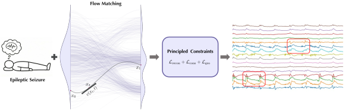

<div align="center">

<h1>Let EEG Models Learn EEG</h1>
<h3>✨ ICML 2026 ✨</h3>

<br>

Yifan Wang<sup>1</sup>, Yijia Ma<sup>2</sup>, Wen Li<sup>2</sup>, Chenyu You<sup>1</sup>

<sup>1</sup>Stony Brook University &nbsp; <sup>2</sup>University of Texas Health Center at Houston

<p>
  <a href="https://arxiv.org/abs/2605.21280">
    
  </a>
  <a href="https://y-research-sbu.github.io/JET/">
    
  </a>
  <a href="https://huggingface.co/Y-Research-Group/JET">
    
  </a>
 
</p>

</div>

---

<div align="center">

</div>

## Installation

```bash
conda create -n jet python=3.10 -y
conda activate jet
pip install torch --index-url https://download.pytorch.org/whl/cu128
pip install -r requirements.txt
```

## Data Preprocessing

JET trains on three corpora from the [Temple University Hospital EEG project](https://isip.piconepress.com/projects/nedc/html/tuh_eeg/). Each dataset must be requested and downloaded with the TUH credentials.

| Dataset | Source                                                                                                                                          | Notes                                |
|---------|-------------------------------------------------------------------------------------------------------------------------------------------------|--------------------------------------|
| TUAB    | [`tuh_eeg_abnormal`](https://isip.piconepress.com/projects/nedc/data/tuh_eeg/tuh_eeg_abnormal/)                                    | normal vs. abnormal recordings       |
| TUEV    | [`tuh_eeg_events`](https://isip.piconepress.com/projects/nedc/data/tuh_eeg/tuh_eeg_events/)                                        | 6-class EEG events (.edf + .rec)     |
| TUSZ    | [`tuh_eeg_seizure`](https://isip.piconepress.com/projects/nedc/data/tuh_eeg/tuh_eeg_seizure/)                                      | background vs. seizure (.edf + .tse) |


```bash
python data/preprocess_tuab.py \
  --input-dir  /path/to/tuh_eeg_abnormal/edf \
  --output-dir ./datasets/tuab

python data/preprocess_tuev.py \
  --input-dir  /path/to/tuh_eeg_events/edf \
  --output-dir ./datasets/tuev

python data/preprocess_tusz.py \
  --input-dir  /path/to/tuh_eeg_seizure/edf \
  --output-dir ./datasets/tusz
```

The resulting layout is:

```text
datasets/
├── tuab/
│   ├── train/*.pkl    
│   ├── val/*.pkl
│   └── test/*.pkl
├── tuev/
│   ├── train/*.pkl    
│   ├── val/*.pkl
│   └── test/*.pkl
└── tusz/
    ├── train/*.pkl    
    ├── val/*.pkl
    └── test/*.pkl
```

## Training

Train JET on TUAB / TUEV / TUSZ directly using the scripts:

```bash
bash scripts/train_tuab.sh /path/to/datasets/tuab ./output/tuab
bash scripts/train_tuev.sh /path/to/datasets/tuev ./output/tuev
bash scripts/train_tusz.sh /path/to/datasets/tusz ./output/tusz
```

Or run `train_eeg.py` directly:

```bash
python train_eeg.py \
  --dataset tuab \
  --datasets_dir /path/to/datasets/tuab \
  --output_dir ./output/tuab \
  --model JiT-B/16 \
  --num_eeg_channels 16 --target_length 2000 --eeg_patch_size 200 \
  --batch_size 256 --epochs 200 --blr 5e-5 \
  --loss_type mix --loss_weight_stat 1.0 --loss_weight_tv 0.1 --loss_weight_corr 0.1
```

Training writes a TensorBoard run and `checkpoint-last.pth` under `--output_dir`.

## Inference

Run inference for TUAB / TUEV / TUSZ directly using the scripts:

```bash
bash scripts/infer_tuab.sh /path/to/datasets/tuab ./ckpt/jet_tuab ./output/eval_tuab
bash scripts/infer_tuev.sh /path/to/datasets/tuev ./ckpt/jet_tuev ./output/eval_tuev
bash scripts/infer_tusz.sh /path/to/datasets/tusz ./ckpt/jet_tusz ./output/eval_tusz
```

Or run `inference.py` directly:

```bash
python inference.py \
  --dataset tuab \
  --datasets_dir /path/to/datasets/tuab \
  --resume ./ckpt/jet_tuab \
  --output_dir ./output/eval_tuab \
  --num_images 0 --gen_bsz 64 \
  --eval_split train --eval_label_mode match_gt
```

Each run writes `eval_batch.npz` and `metrics.json` under the output directory.

<!-- ## Released Checkpoints

| Dataset | Checkpoint |
|---|---|
| TUAB | `ckpt/jet_tuab` |
| TUEV | `ckpt/jet_tuev` |
| TUSZ | `ckpt/jet_tusz` | -->


## Citation

If you find this work useful, please consider citing:

```bibtex
@article{wang2026let,
  title   = {Let EEG Models Learn EEG},
  author  = {Wang, Yifan and Ma, Yijia and Li, Wen and You, Chenyu},
  journal = {ICML},
  year    = {2026}
}
```

## License

This project is released under the [MIT License](LICENSE).
